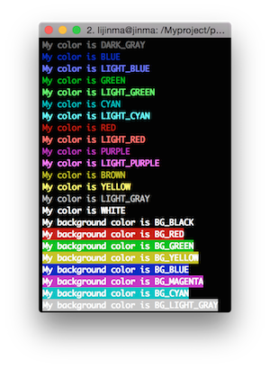
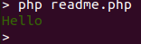

# php-cli-colors

Liven up you PHP Console Apps with standard colors

[View on Packagist](https://packagist.org/packages/codedungeon/php-cli-colors)



## Installation

`composer require codedungeon/php-cli-colors '~1.0'`

or update your `composer.json`

```
    ...
    "require": {
        "codedungeon/php-cli-colors": "~1.0"
    },
    ...
```

## How to use

```php
<?php

require __DIR__ . '/vendor/autoload.php';

use Codedungeon\PHPCliColors\Color;

echo Color::GREEN, 'Hello', Color::RESET, PHP_EOL;
```


See `rainbow.php` sample for more details

## License

Copyright &copy; 2017-2020 Mike Erickson
Released under the MIT license

### Credits

php-cli-color written by Mike Erickson

E-Mail: [codedungeon@gmail.com](mailto:codedungeon@gmail.com)

Twitter: [@codedungeon](http://twitter.com/codedungeon)

Website: [codedungeon.org](http://codedungeon.org)

### Screenshot


